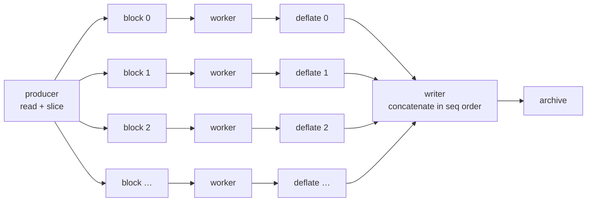

# miniZip

A small, fast, standards-correct ZIP archiver in a single C file.

miniZip started as a **Software Reverse Engineering** project at Virginia Tech:
disassemble WinZip, work out how it lays down a ZIP archive, and rebuild that
behaviour from scratch. Every byte of the container format is still written by
hand here — no archive library, only `zlib` for the DEFLATE codec itself.

It has since grown past the classroom version into something you can actually
point at a directory: it compresses in parallel, streams instead of buffering,
speaks ZIP64, and is checked against third-party extractors on every test run.

```
$ minizip -9 -r site.zip public/
minizip: creating 'site.zip'  (level 9, 24 threads, 256 KiB blocks)
  deflate  96.5%       4548894 -> 158813        public/app.js
  deflate  96.2%       1388894 -> 53051         public/css/site.css
  deflate  84.3%       3106067 -> 487448        public/data.json
  store     0.0%        921600 -> 921600        public/img/hero.jpg
minizip: 7 entries, 9.5 MiB -> 1.5 MiB (83.7% saved) in 0.02s, 461.6 MiB/s
```

Note `hero.jpg`: already-compressed data is detected and stored rather than
run through DEFLATE for nothing.

---

## Highlights

| | |
|---|---|
| **Parallel DEFLATE** | pigz-style independent blocks across all cores — 10× faster than `zip(1)` at `-6`, 17× at `-9` |
| **Deterministic** | byte-identical output regardless of thread count or scheduling |
| **Streaming** | constant memory; a 5 GiB member costs the same RAM as a 5 KiB one |
| **ZIP64** | members > 4 GiB, archives > 4 GiB, more than 65535 entries |
| **Smart STORE** | trial-compresses a sample and skips DEFLATE on data that will not shrink |
| **Faithful metadata** | Unix permissions, symlinks, UTF-8 names, clamped MS-DOS timestamps |
| **Safe names** | `..`, leading `/` and drive letters are stripped; `-r` never swallows its own output |
| **No dependencies** | one `.c` file, `zlib` and `pthreads` |

---

## Build

Requires a C99 compiler, `zlib`, and pthreads.

```bash
make                # -> build/minizip
make test           # build and run the conformance suite
sudo make install   # -> /usr/local/bin/minizip
```

Other targets:

| Target | What it does |
|---|---|
| `make debug` | `-O0 -g3` with AddressSanitizer and UndefinedBehaviorSanitizer |
| `make no-threads` | serial build, `-DMZ_NO_THREADS`, drops the pthreads dependency |
| `make zip64` | the multi-gigabyte ZIP64 tests (needs ~11 GB of scratch space) |
| `make bench` | throughput and ratio comparison against `zip(1)` |

Or, without the Makefile:

```bash
cc -O2 -o minizip src/minizip.c -lz -lpthread
```

---

## Usage

```
minizip [options] <archive.zip> <path>...
```

**Compression**

| Option | Meaning |
|---|---|
| `-0` … `-9` | compression level (`0` = store, default `6`) |
| `-l, --level N` | same as `-N` |
| `-s, --store` | store everything, never DEFLATE |
| `--strategy NAME` | `default` \| `filtered` \| `huffman` \| `rle` |
| `--no-probe` | do not trial-compress before choosing STORE |

**Parallelism**

| Option | Meaning |
|---|---|
| `-T, --threads N` | worker threads; `0` = serial. Default: CPU count, capped at 32 |
| `-b, --block SIZE` | parallel block size, e.g. `64K`, `1M`. Default `256K`, clamped to 64 KiB…256 MiB |

**Input selection**

| Option | Meaning |
|---|---|
| `-r, --recurse` | descend into directories |
| `-j, --junk-paths` | store bare filenames, discard directory components |
| `-L, --follow` | follow symlinks instead of storing them as links |

**Output**

| Option | Meaning |
|---|---|
| `-q, --quiet` | report errors only |
| `-v, --verbose` | per-entry detail, including directories and skipped files |
| `-h, --help` / `-V, --version` | |

### Examples

```bash
minizip -9 -r site.zip public/           # maximum ratio, whole tree
minizip -T 8 -b 1M backup.zip disk.img   # 8 workers, larger blocks for a big file
minizip -j -1 quick.zip logs/access.log  # fast, filename only
minizip -s -r raw.zip photos/            # no compression, just container it
```

Exit status is `0` on success, `1` if any file was skipped with a warning, and
`2` on a usage error.

---

## How the parallel DEFLATE works

The interesting part. DEFLATE is a serial format — each match may reference any
of the previous 32 KiB — so you cannot naively cut a stream into pieces and
compress them independently without either breaking the format or destroying
the ratio. miniZip uses the approach pigz popularised:



1. The producer thread slices the input into fixed-size blocks (`-b`, default
   256 KiB) and hands each to a worker along with **the last 32 KiB of the
   previous block**.
2. Each worker calls `deflateSetDictionary()` with those 32 KiB before
   compressing. The block therefore starts with a warm window and can still
   match against data it never sees, which is where almost all of the ratio
   comes from.
3. Every non-final block is terminated with `Z_SYNC_FLUSH`. That closes the
   current DEFLATE block **on a byte boundary**, so the compressed pieces
   concatenate into one valid stream. The final block uses `Z_FINISH` to set
   the `BFINAL` bit.
4. Each worker also CRC32s its own block. The producer folds the per-block
   values together with `crc32_combine()`. Doing the checksum on the workers
   matters more than it sounds — while it lived on the producer thread it
   capped the whole pipeline at about 4× no matter how many cores were
   available.
5. The writer drains blocks strictly in sequence order, so block boundaries
   depend only on `-b` and never on scheduling. **The output is bit-for-bit
   identical at any thread count**, which the test suite asserts.

A ring of `2·threads + 2` block buffers provides backpressure, so memory stays
bounded no matter how large the input is.

### What block splitting costs

Priming each block with a dictionary recovers nearly all of the ratio, but not
quite all of it. Measured on 281 MiB of log-like text at `-9`, against
Info-ZIP's single-stream output:

| `-b` | archive size | penalty |
|---|---|---|
| 64K | 10 621 198 | +0.525 % |
| **256K** (default) | **10 574 975** | **+0.088 %** |
| 1M | 10 569 709 | +0.038 % |
| 8M | 10 566 128 | +0.004 % |
| 64M | 10 565 699 | +0.000 % |

The default trades under a tenth of a percent of ratio for fine-grained
parallelism. Raise `-b` if you care more about the last few kilobytes than
about spreading a single file across many cores.

---

## Benchmarks

281 MiB of log-like text, 24-core machine, everything in page cache, zlib
1.2.11. `make bench` reproduces this shape of measurement on your own hardware.

**Scaling**

| Threads | Time | Throughput |
|---|---|---|
| `-T 0` (serial) | 1.03 s | 273 MiB/s |
| `-T 2` | 0.42 s | 670 MiB/s |
| `-T 4` | 0.20 s | 1 406 MiB/s |
| `-T 8` | 0.11 s | 2 557 MiB/s |
| `-T 16` | 0.09 s | 3 125 MiB/s |
| `-T 24` | 0.09 s | 3 125 MiB/s |

Scaling flattens around 16 threads, where reading and writing rather than
compression become the limit.

**Against Info-ZIP**

| | Time | Size | Notes |
|---|---|---|---|
| `minizip -6 -T 24` | **0.09 s** | 10 772 255 | 10× faster, 5 KiB *smaller* |
| `zip -6` | 0.90 s | 10 777 449 | |
| `minizip -9 -T 24` | **0.16 s** | 10 574 975 | 17× faster, 0.09 % larger |
| `zip -9` | 2.74 s | 10 565 694 | |

miniZip edges out Info-ZIP at `-6` because it runs zlib at `memLevel 9` rather
than the historical default of 8, which gives the matcher the full hash space.
At `-9` the block-splitting penalty is slightly larger than that gain.

Incompressible input is where the probe pays for itself: 64 MiB of random data
is detected and stored rather than pushed through DEFLATE, so it is copied at
I/O speed instead of being deflated into something marginally larger.

---

## Correctness

miniZip is never validated against itself. Every archive the test suite
produces is checked by **Info-ZIP `unzip -t`** (which verifies each member's
CRC) and, where relevant, extracted and diffed against the source tree.
Archives are additionally cross-checked with Python's `zipfile` module.

```
$ make test
miniZip test suite  (build/minizip)

  ok   single file archive passes unzip -t
  ok   recursive archive passes unzip -t
  ok   round-trip is byte-identical to the source tree
  ok   output is byte-identical at T=0,1,2,4,8,16
  ok   parallel-deflated data inflates back to the original
  ok   64 KiB blocks at level 9 reconstruct the original exactly
  ok   empty file produces a valid, empty member
  ok   incompressible data is detected and stored, not deflated
  ok   -j strips directory components
  ok   -s stores everything
  ok   non-ASCII names round-trip with the UTF-8 flag
  ok   '..' and leading '/' are stripped from stored names
  ok   -r skips the archive being written
  ok   levels 0/1/6/9 all produce valid archives
  ok   zipinfo parses the central directory
  ok   Unix permissions are stored in the external attributes
  ok   python3 zipfile agrees about CRCs, flags and attributes

  17 passed, 0 failed
```

`make zip64` covers the 64-bit paths that need real data behind them — a 5 GiB
member, an archive past the 4 GiB offset boundary, and 70 000 entries to force
the ZIP64 end-of-central-directory record.

The threaded pipeline is clean under **ThreadSanitizer**, and the whole program
is clean under **AddressSanitizer + UBSan** including leak detection.

---

## Container layout

What miniZip writes, in order:

```
┌──────────────────────────────────────────────┐
│ local file header  (+ ZIP64 extra if needed) │  ← per member
│ file name                                    │
│ compressed data                              │
├──────────────────────────────────────────────┤
│                     …                        │
├──────────────────────────────────────────────┤
│ central directory header  (+ ZIP64 extra)    │  ← per member
│ file name                                    │
├──────────────────────────────────────────────┤
│                     …                        │
├──────────────────────────────────────────────┤
│ ZIP64 end of central directory record        │  ← only when needed
│ ZIP64 EOCD locator                           │
│ end of central directory record              │
└──────────────────────────────────────────────┘
```

Because compression is streamed, the CRC and the compressed size are not known
when the local header goes down. miniZip writes the header with placeholders
and seeks back to patch it once the member is complete — including the method
field, since a member written as DEFLATE can be demoted to STORE if it turned
out to expand. This keeps the archive readable by extractors that ignore data
descriptors, which is why no general-purpose bit 3 is ever set.

ZIP64 fields are emitted only when a 32-bit slot actually saturates, in the
order APPNOTE §4.5.3 requires, so archives stay maximally compatible with old
tools.

---

## Project layout

```
miniZip/
├── src/minizip.c        # the whole archiver
├── Makefile
├── tests/
│   ├── run_tests.sh     # conformance suite, validated with unzip
│   ├── zip64.sh         # multi-gigabyte ZIP64 tests
│   └── bench.sh         # throughput/ratio comparison against zip(1)
└── README.md
```

---

## Limitations

- **Writes archives only.** There is no extractor; use `unzip`.
- **No encryption.** Neither legacy ZipCrypto nor AES. ZipCrypto is broken and
  AES-in-ZIP is a vendor extension.
- **No append or update** of an existing archive; the output is always created
  fresh.
- **Deflate only** (plus store). No bzip2, LZMA, XZ or Zstandard methods.
- **POSIX-oriented.** It compiles on Windows with `-DMZ_NO_THREADS`, but
  symlink members and `lstat`-based recursion are POSIX paths.

---

## Roadmap

- Zopfli backend as an opt-in `-11`, trading a lot of CPU for ~5 % better ratio
  on the same DEFLATE format — a natural fit for the block pipeline
- Extended timestamp extra field (0x5455) for full-precision mtimes
- Archive reading and listing, so miniZip can verify its own output
- A GUI front end (drag-and-drop, level slider, progress) over this CLI core

---

## Origin and tools

The original reverse-engineering work that this is built on:

- **IDA Free / Ghidra** — static analysis of the WinZip binary
- **x64dbg** — dynamic tracing of the compression entry points
- **ZIP APPNOTE** — the authoritative container reference
- **zlib** — DEFLATE codec

The findings that mattered: which header fields WinZip actually populates
versus leaves zero, how it chooses between STORE and DEFLATE, and how the
central directory is buffered in memory before being flushed at the end. All
three shaped this implementation.

## Legal notice

For educational purposes. All analysis was performed in a controlled
environment for academic use. WinZip is a trademark of Corel Corporation;
this project is not affiliated with or endorsed by them.

## Author

**Jackson Giordano** — Computer Science, Virginia Tech
Software Reverse Engineering, Spring 2025

## References

- [ZIP File Format Specification (PKWARE APPNOTE)](https://pkware.cachefly.net/webdocs/casestudies/APPNOTE.TXT)
- [RFC 1951 — DEFLATE Compressed Data Format](https://www.rfc-editor.org/rfc/rfc1951)
- [zlib manual](https://zlib.net/manual.html)
- [pigz](https://zlib.net/pigz/) — the parallel-DEFLATE technique used here
- [Ghidra](https://ghidra-sre.org/)
